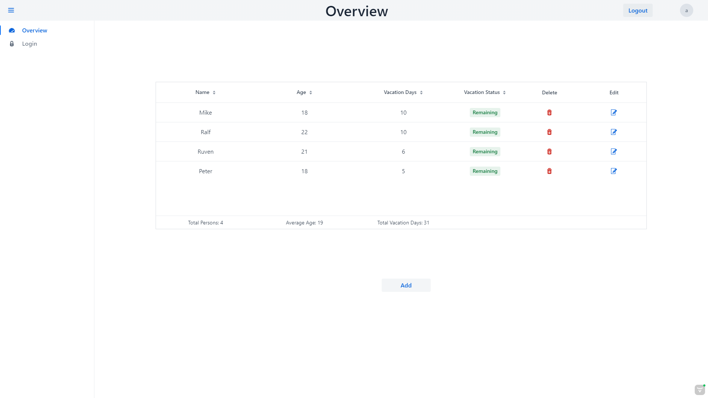
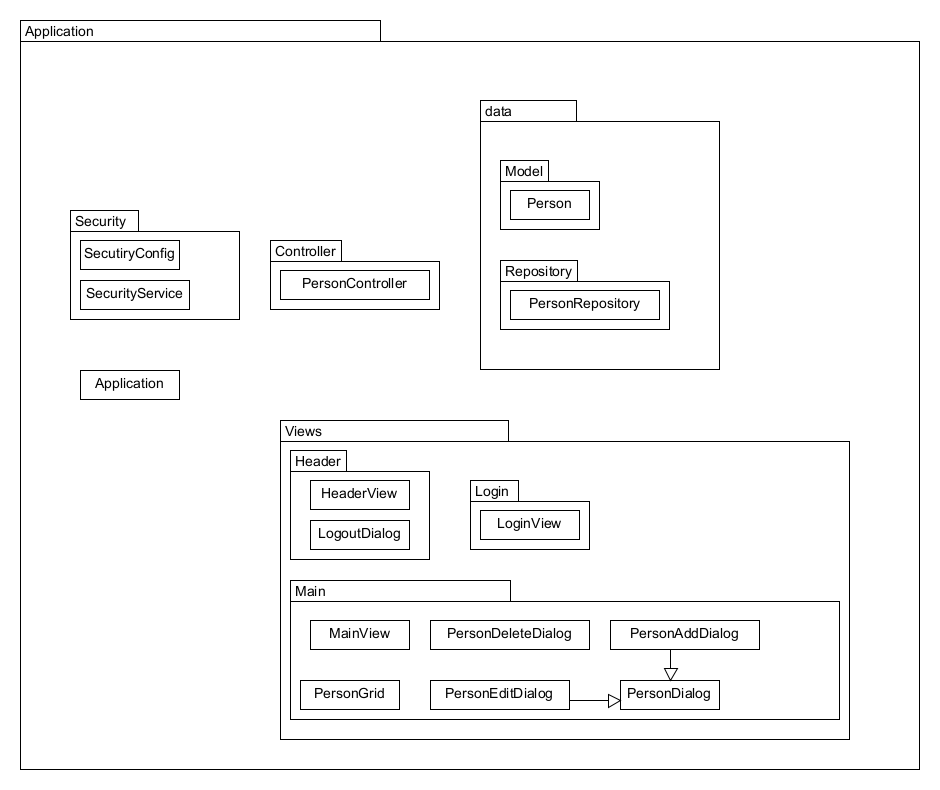

 # AdvancedVaadin
 
## Application

## Overview

## Database
After application launch you can visit the DB here: ``http://localhost:8080/h2-console/`` with the JDBC URL: ``jdbc:h2:mem:testdb`` Username ``sa`` and empty password.